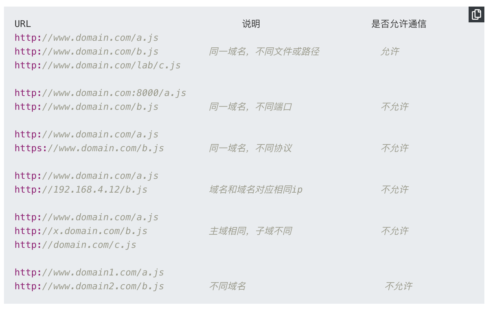

# Btyedance

 ### [HTTP和HTTPS](https://www.huaweicloud.com/articles/d81c7888a0713fca6141423cefb8661d.html)
  #### HTTP
  + Hyper Text Transfer Protocol（超文本传输协议）
  + 客户端浏览器和web服务器之间的应用层通信协议
  + 所有的www文件都必须遵循这个标准
  #### TCP和IP
  + tcp和udp协议是在传输层，，web以http协议作为应用层，以封装HTTP文本信息，然后使用TCP/IP作为传输层协议将他们发到网络上
  + 7层关系
  + TCP和UDP就像卡车，IP就像高速公路，HTTP就像卡车携带的货物
  + 从下至上来看，物理层-> 数据链路层-> 网络层-> 传输层-> 会话层-> 表示层-> 应用层
  #### SSL和TSL
  + SSL：（Secure Sockets Layer 安全嵌套层），SSL协议分为两层： SSL 记录协议（SSL record protocol），它建立在可靠的传输协议上，例如TCP，为高层协议提供数据封装，压缩，加密等基本功能的支持； SSL 握手协议（SSL handleshake protocol），它建立在SSL 记录协议上，用于实际的传输前，通讯双方进行身份认证，协商加密，交换密钥等
  + TSL：SSL的继任者传输层安全（Transport Layer Security）：为网络通信提供安全及数据完整性的安全协议，以及检验客户端和服务器是否安全。
  + TSL和SSL在传输层对 网络进行加密，SSL在应用层和TCP层之间，应用层不再直接传输给传输层，而是传递给SSL层，SSL层从应用层收到的数据进行加密，并增加自己的SSL头
  #### HTTPS
  + Hyper Text Transfor Protocol over Sercure Socket Layer（以目的为安全的HTTP通道），即HTTP的安全版，即HTTP加入了SSL层，HTTPS的安全基础是SSL，因此加密的信息就需要SSL
  ##### HTTPS和HTTP区别
   + HTTP协议是以明文方式发送内容，不提供任何方式的数据加密。HTTPS在HTTP协议的基础上，加入了SSL协议，SSL依靠证书来验证服务的身份，并为浏览器和服务器之间的通信加密。
   + HTTPS的主要作用： 
     + 对数据进行加密，并建立一条信息安全通道，来保证传输过程中的数据安全
     + 对网站服务器进行真实身份识别
   + HTTPS和HTTP主要区别
     + HTTPS需要到ca申请证书，一般免费证书很少
     + HTTP是超文本传输协议，是明文传输。HTTPS则是具有安全性的SSL加密传输协议
     + HTTP和HTTPS使用的链接方式不同，HTTP常用的是80端口，HTTPS为443

### 如何解决跨域
  #### 什么是跨域： 一个域下的脚本或文档想去访问另一个域的资源，这里的跨域是广义的。
  #### 什么是广义的跨域
  + 资源跳转（a链接，重定向，表单提交）
  + 资源嵌入（< link>,< iframe>< script>,background: url之类的文件外链）
  + 脚本请求：js发起的ajax请求，dom和js的跨域操作等
  + 其实我们所说的跨域都是狭义下的跨域，是由浏览器同源策略下限制的一类请求
  #### 同源策略（SOP same origin policy）
  + 是一种约定：指协议+域名+端口三者相同，即使两个不同的域名指向同一个ip地址，也不是同源。它是浏览器最核心也是最基本的安全功能，如果缺少同源策略，浏览器很容易受到XSS，CSFR的攻击。
  + 同源策略限制后的几种行为
    + localStorage,cooike,indexDB无法获取
    + DOM和js对象无法获取
    + AJAX请求无法发送
  #### 常见的跨域场景
  #### 常见的跨域解决方案
  + 1.JSONP跨域：
    + 原理：通常为了减轻web服务器的负载压力，我们将js，img，css等静态资源分离到另一台独立域名的服务器上，在html页面中再通过相应的标签从不同的域名加载静态资源，而被浏览器允许，基于此原理，我们可以动态创建script，再请求一个带参网址实现跨域。
    + 原生实现：
      + 前端
      ```
      <script>
      var script = document.createElement('script');
      script.type = 'text/javascript';

      // 传参一个回调函数名给后端，方便后端返回时执行这个在前端定义的回调函数
      script.src = 'http://www.domain2.com:8080/login?user=admin&callback=handleCallback';
      document.head.appendChild(script);

      // 回调执行函数
      function handleCallback(res) {
          alert(JSON.stringify(res));
      }
      </script>
      ```
      + 服务端返回如下（返回时即执行全局函数）：
      ```
      handleCallback({"status": true, "user": "admin"})
      ```
    
