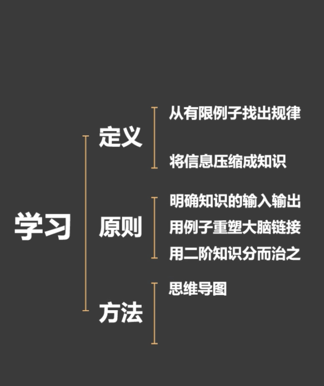
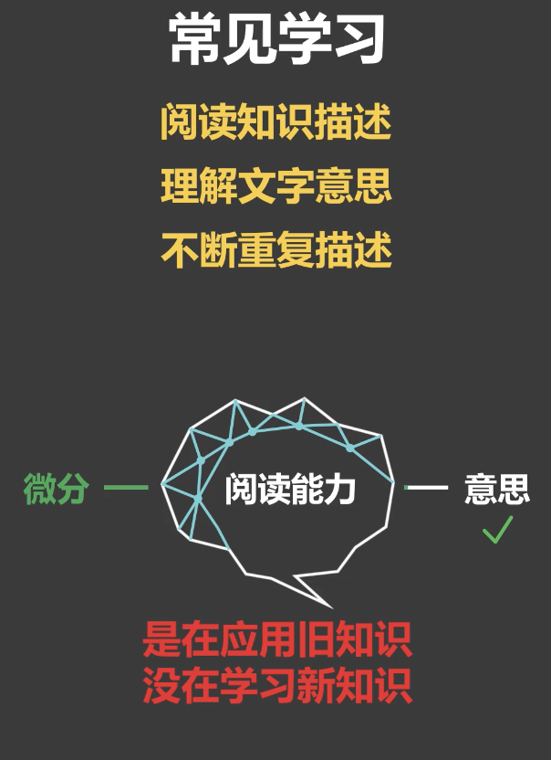
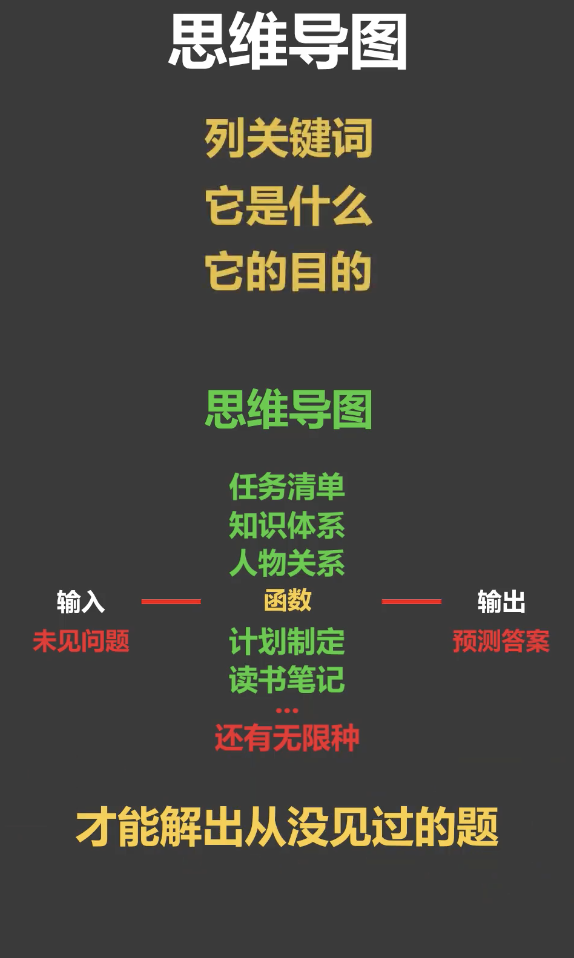
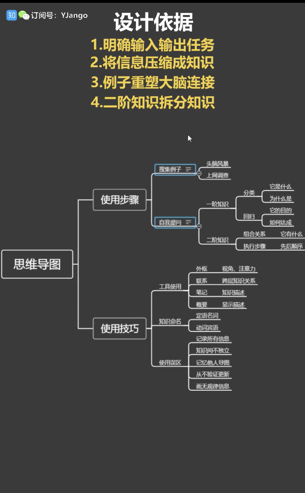

# How We Learn

### 1.什么是学习

  #### 学习： 在有限的例子中，找出问题和答案之间规律的过程
  #### 知识： 所找出来的规律就是知识。
  + 如果你没有办法描述你的知识，那你就没有真正学会它，因为学习就是在用知识压缩原本无限的信息
  
### 2.把书读薄
  #### 学习的第一步： 明白什么是问题，什么是问题的答案。 有些人压根不知道什么是问题的答案，只记住了知识的描述。 然而知识不是信息，学习不是记忆，这也是人们在教与学的过程常遇到的问题，以为把知识告诉了某人，对方就就可以学会，然而知识的描述只是对学习起到了引导的作用，最终的学习一定要通过例子理清问题和答案的关系来重塑大脑链接。这也是为什么讨论，写文章会伴随着例子，而不是单纯的对知识进行描述。由于学习是为了解决新问题，所以需要验证现有例子所提炼的知识，是否能描述问题和答案之间的规律，而不是仅仅记住了这些现有的例子

### 3.英文如何学：
学习最重要的两步明确问题，输入和答案输出，用例子构建知识学习方式分为两大类，运动类（语言，运动）和思考类（数学，逻辑）。
区别在于是否依靠意识，因为意识是后进化出来的，擅长解决的是推断问题，但速度缓慢。学不会的原因都出在错误的输入、输出，错误的学习方式，用思考类方式来学习所有知识，比如看书学游泳，不通过例子仅记忆知识。
以语言为例四项能力的正确输入、输出、类型分别是（听声音-说想法-读文字-写想法），应试英语的普遍误区是输入、输出变成了完形填空，阅读选择等。这类从一些文字到到另一些文字做思考类问题，用百词斩背单词还容易产生另一种偏差输入输出变成了图片到中文，英语学习中作为致命的是插入的中文思考这个中间输出不仅输出错误，而且非常缓慢会让很多种懂外语但未经训练的人同时翻译中文的话，他们会反应不过来就是因为他们的大脑在这个过程中其实并不思考中文，当出国后就会发现所学英语的输入和真实英语的输入是不同的，根本用不了。不通过例子仅记忆知识也是特别常见的错误由于语言的由于语言的输入从来就不是一个单词，而是一个句子.要想把握句子中某个单词的真正含义.需要通过体会大量不同的列句，但多数时候，学生仅仅是记住了单词的中文描述，很多英语名师也都犯一样的错误，不管他们总结的再好，若仅仅是把他的总结告诉学生，学生永远都是把他的总结当成信息记忆，而不是作为知识学习。学不会英语，是因为搞错了输入输出。造成学到的是完全不同的知识。

### 4.思维导图原理：人生与高手之差

#### 学习流程

#### 常规学习

#### 思维导图的学习模式

### 5.如何设计思维导图

