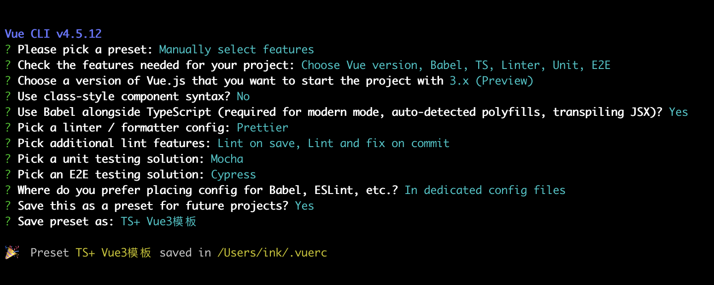
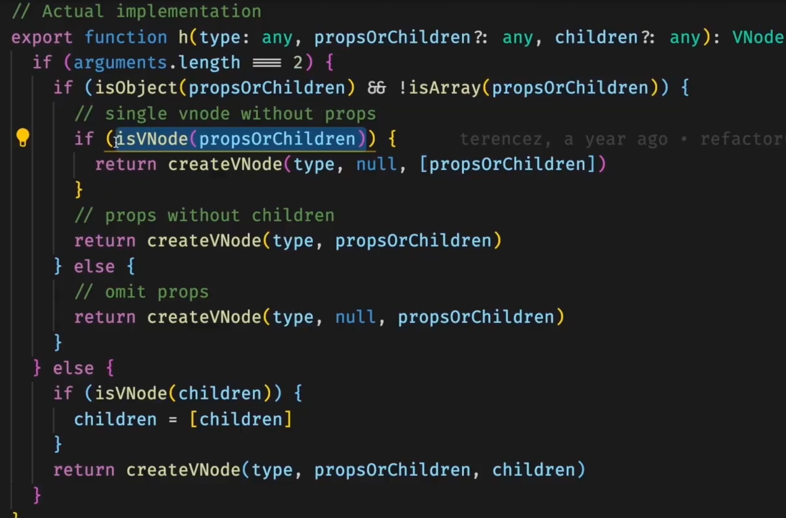

# Vue3 + TypeScript

使用Vue3+ TypeScript打造一个企业级组件库

## 1.课程安排

1. 项目结构
2. 开发模式讲解
3. Vue3的定义
4. 单元测试
5. 高泛用性的API
6. 响应式原理
7. 完善功能开发
8. 自动化发布流程

## 2.启动项目准备工作

### 1.Vue3更新概览

1. [vue RFCS](https://github.com/vuejs/rfcs)
2. slot Api 的变化 
   1. 可通过#header 代表具名插槽
3. 全局 Api的变化
   1. 直接通过import 导入即可
4. Compontent-Api 

### 2.使用vue-cli创建TS项目

1. 安装vue-cli
   ```
   cnpm i -g @vue/cli
   ```
2. 创建项目
   ```
   vue create project
   ```
3. 配置项目（TS版本）
  

### 3.格式化工具prettier

1. 在项目中创建.prettierrc文件
2. 配置 
   ```
   {
      "semi": false, (不需要分号)
      "singleQuote": true, （单引号）
      "arrowParens": "always", （剪头函数需要（））
      "trailingComma": "all" （结尾以','结束）
    }
   ```
3. 使用 
   1.  打开设置， 搜索formatter，
   2.  勾选 Editor: Format On Save 即可（在工作区而不是在user）

### 4.h函数的详情解读

1. 可使用import的方式导入api
   ```
   import { createApp, h } from 'vue'
   createApp(App).mount('#app')
   ```
2. h函数类似react的createElement， 接收三个参数， h(节点类型，节点属性，children选项))
   ```
   <div id="app">
    
    <HelloWorld msg="xasdadas" :age="12"  />
   </div>

   使用h函数可转换成如下代码
   const img = require('/images/h.png') // eslint-disable-line
   const App = defineComponent({
     render({
       return h('div', {
         id: 'app'
       }, [
         h('img', {
           alt: '',
           src: img
         }),
         h(HelloWord, {
           msg: 'xasdadas',
           age: 12
         })
       ])
     })
   })
   ```
3. 图片导入这块的可通过require的方式进行导入，如果遇到eslint的报错，可使用// eslint-diasble-line
4. h函数源码解析
  
5. watchEffect注意点
   ```
   watchEffect(() => {
     console.log(h.value) //只监听这个h的值的变化
   })
   ```
### 5.使用jsx开发vue3组件
 1. 如何改造
    1. 下载依赖 
    ```
    yarn add @vue/babel-plugin-jsx -D

    ```
    2. 在babel.config.js中配置
    ```
    module.exports = {
      plugins: ["@vue/babel-plugin-jsx"],
    }
    ```
    3. 创建一个.tsx结尾的文件
    ```
    import { defineComponent, reactive } from 'vue'
    import HelloWord from './HelloWorld'
    function renderHelloWord(num: number) {
      return <HelloWord age={num} />
    }
    export default defineComponent({
      setup() {
        return () => {
          const state = reactive({
            name: 2,
          })
          return (
            <div>
              {renderHelloWord(9)}
              <h1>1231</h1>
              <p>{state.name}</p>
            </div>
          )
        }
      },
    })

    ```
2. 使用tsx的优势
    - 使用组件时，可提供eslint的格式化校验
    - 变量声明
    - 抽离共有逻辑,更加灵活
      ```
      import { defineComponent } from 'vue'
      const PropsType = {
        msg: String,
        age: {
          type: Number,
          required: true,
        },
      } as const
      export default defineComponent({
        props: PropsType,
        setup(props) {
          return () => (
            <div>
              <span>我是你</span>
              {props.age}
            </div>
          )
        },
      })

      ```

### 6.ajv校验json-schema
- 1. 下载依赖
  ```
  yarn add ajv -D
  ```
- 2. 引入ajv
```
/* eslint-disable */ 在typeScript中使用import会导致报错， 这使用eslint-disable规避require的方式
const Ajv = require('ajv').default
const ajv = new Ajv()
const schema = {
  type: 'object',
  properties: {
    name: {
      type: 'string',
      minLength: 10,
    },
    age: {
      type: 'number',
    },
    record: {
      type: 'array',
      items: [{
          type: 'string'
        },
        {
          type: 'number'
        },
      ]
    }
  }
}
const validate = ajv.compile(schema)
const valid = validate({
  name: '21312311231asddada',
  age: 11,
  record: ['sda', 12131]
})
if (!valid) console.log(validate.errors)

```

### Images

If you want to embed images, this is how you do it:


### Headers

Sometimes it's useful to have different levels of headings to structure your documents. Start lines with a `#` to create headings. Multiple `##` in a row denote smaller heading sizes.

You can use one `#` all the way up to `######` six for different heading sizes.

### Quotes

If you'd like to quote someone, use the > character before the line:

> Coffee. The finest organic suspension ever devised... I beat the Borg with it.
> - Captain Janeway

### Code

There are many different ways to style code with GitHub's markdown. If you have inline code blocks, wrap them in backticks: `var example = true`.  If you've got a longer block of code, you can indent with four spaces:

    if (isAwesome){
      return true
    }

GitHub also supports something called code fencing, which allows for multiple lines without indentation:

```
if (isAwesome){
  return true
}
```

And if you'd like to use syntax highlighting, include the language:

```javascript
if (isAwesome){
  return true
}
```

#### Highlight specific lines

```{3,5-6}
site/
|── dist    # Output directory
|   └── index.html
├── pagic.config.ts
└── docs    # Source directory
    └── README.md
```

### Tables

First Header | Second Header
------------ | -------------
Content from cell 1 | Content from cell 2
Content in the first column | Content in the second column

## Extras

Pagic supports many extras in markdown.

### TeX (KaTeX)

Inline: $E=mc^2$

Block:

$$
\frac{1}{
  \Bigl(\sqrt{\phi \sqrt{5}}-\phi\Bigr) e^{
  \frac25 \pi}} = 1+\frac{e^{-2\pi}} {1+\frac{e^{-4\pi}} {
    1+\frac{e^{-6\pi}}
    {1+\frac{e^{-8\pi}}{1+\cdots}}
  }
}
$$
